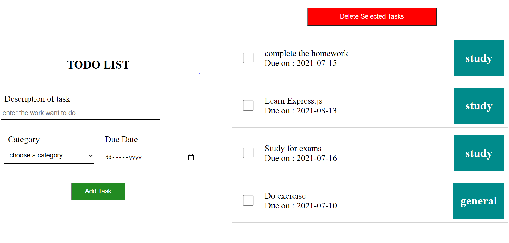
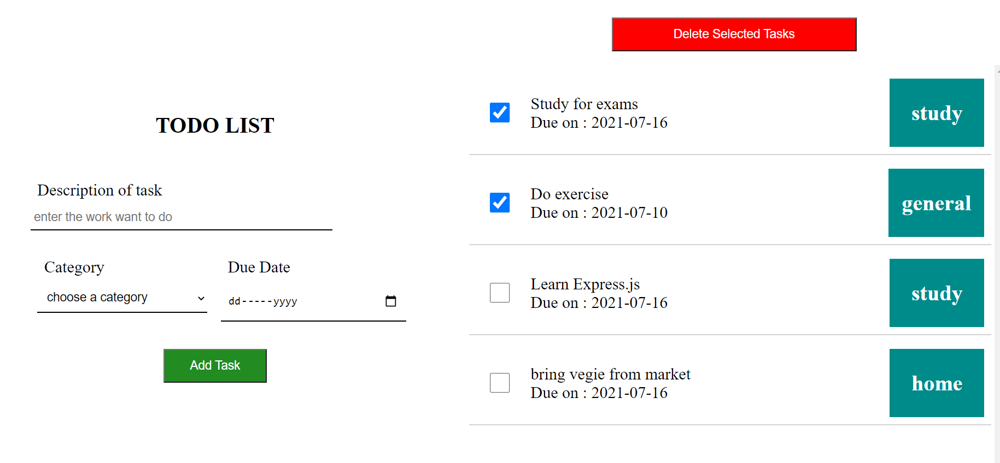
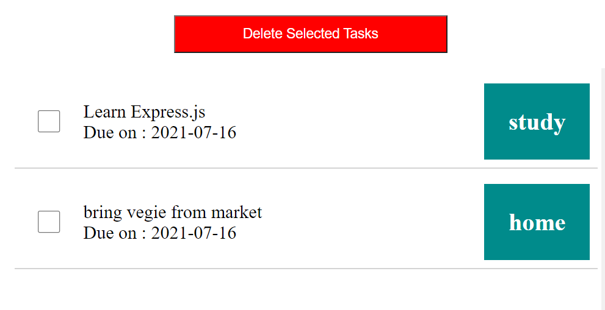

# TODO_APP
It is a TODO APP where user can add their tasks/todo's. 
It is made using Node.js, Express.js, MongoDB.

**[VISIT WEBSITE](https://kanishak-todo-app2.herokuapp.com/)**

## How to run
- clone/download the project from github
- npm install
- npm start or npm run index.js

## prerequisites to run the project
- download node.js
- download mongodb

## features
- add a todo
- remove a todo
- todo's stored in database
- see todos in list view
- mark todo as completed

## Project images

